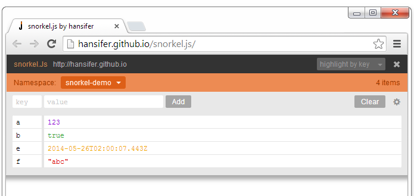

#### Manage any page's snorkel data

Install the [bookmarklet](//hansifer.github.io/snorkel-inspector/bookmarklet-install.html) or the [Google Chrome extension]().

##### Related Links

[snorkel-inspector sandbox](//hansifer.github.io/snorkel-inspector/src/ui_source.html)   
[snorkel.js project](//hansifer.github.io/snorkel.js/)   
[snorkel.js project on Github](https://github.com/hansifer/snorkel.js)
